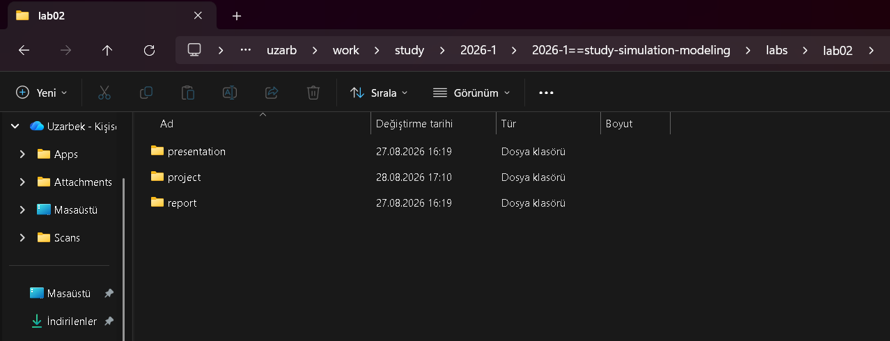
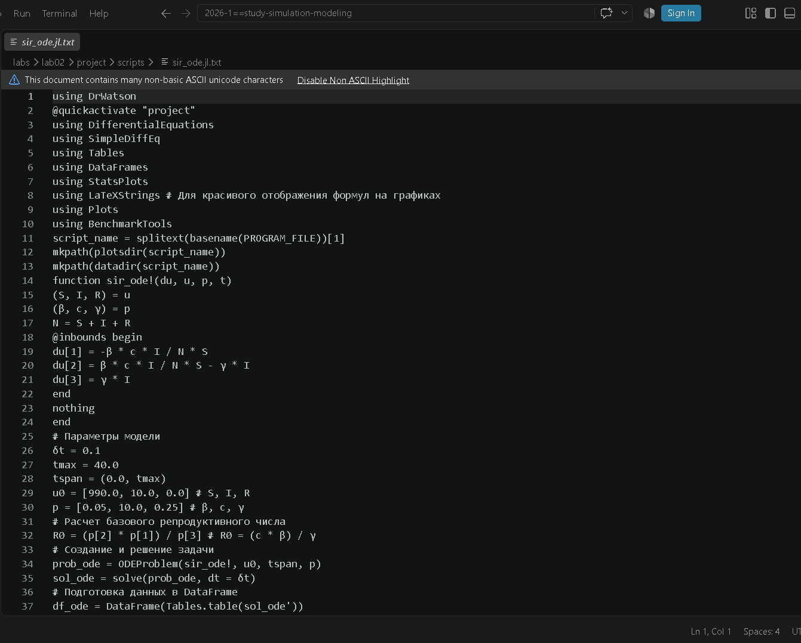
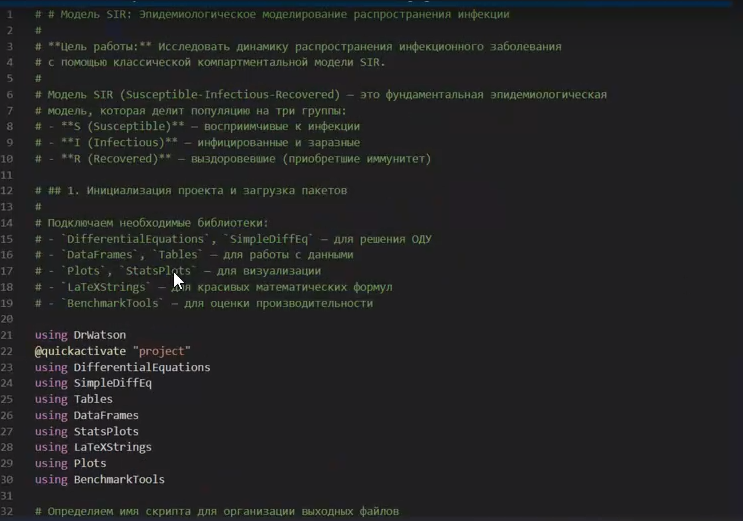
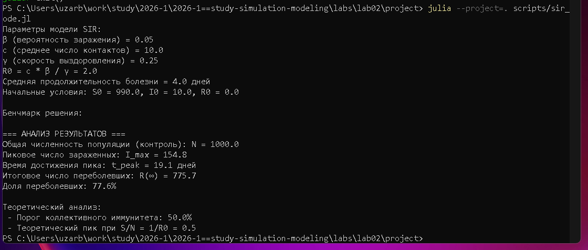
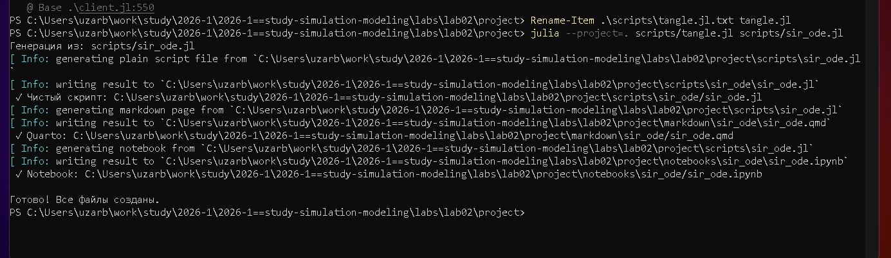
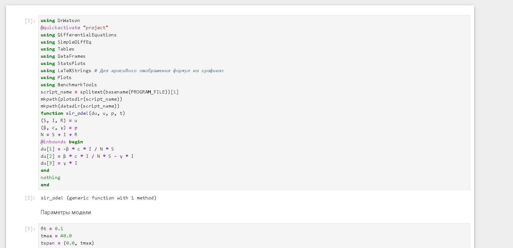
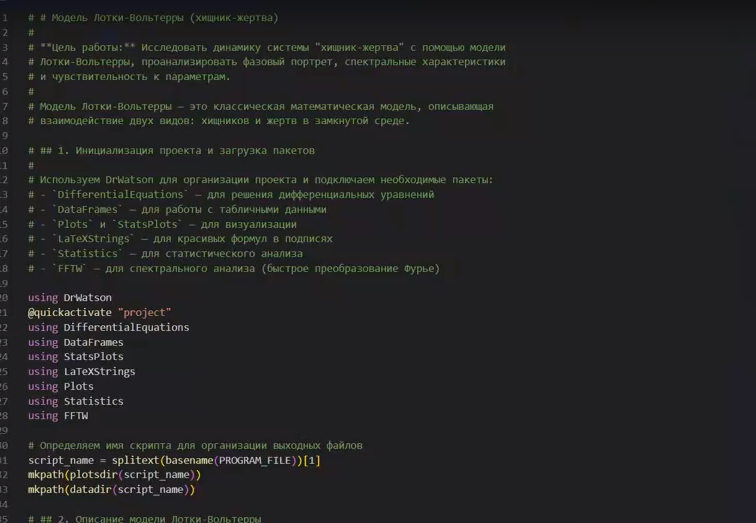
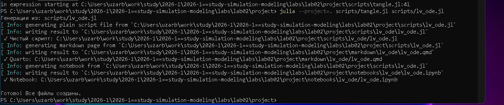
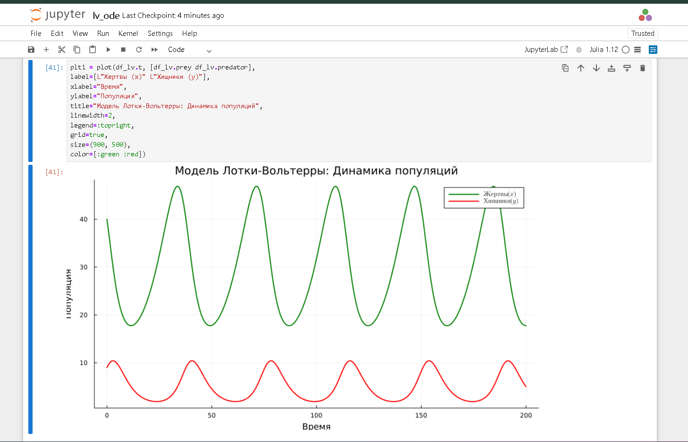

---
## Author
author:
  name: Дмитрий Сергеевич Кулябов
  degrees: DSc
  orcid: 0000-0002-0877-7063
  email: kulyabov-ds@rudn.ru
  affiliation:
    - name: Российский университет дружбы народов
      country: Российская Федерация
      postal-code: 117198
      city: Москва
      address: ул. Миклухо-Маклая, д. 6
## Title
title: Структура научной презентации
subtitle: Простейший вариант
license: CC BY
date: today
date-format: "YYYY-MM-DD" # Example: 2025-09-06
---

# Информация

## Докладчик

:::::::::::::: {.columns align=center}
::: {.column width="70%"}

  * Mehmet Efe Kantoz
  * Ctudent 3 kypc
  * Российский университет дружбы народов им. П. Лумумбы
  * [1032228428@pfur.ru](mailto:1032228428@pfur.ru)

:::
::: {.column width="30%"}

:::
::::::::::::::

# Цель работы

Ознакомится с моделью SIR и моделью Лотки–Вольтерры

# Задание

Здесь приводится описание задания в соответствии с рекомендациями методического пособия и выданным вариантом.

# Теоретическое введение

Модель Лотки–Вольтерры — это фундаментальная математическая модель в экологии, описывающая динамику взаимодействия двух видов: хищников и жертв.
Она была независимо предложена в 1920-х годах:

Модель демонстрирует, как даже простая система взаимодействий может порождать сложные колебательные режимы,
 объясняя циклические изменения численности в природных экосистемах.

Модель SIR есть классическая и фундаментальная математическая модель эпидемиологии, описывающая распространение инфекционного заболевания в закрытой популяции

Модель SIR делит всю популяцию на три взаимосвязанные группы (компартменты), что отражено в её названии:
- S – Susceptible (Восприимчивые): люди, которые не болели, не имеют иммунитета и могут заразиться.
- I – Infectious (Инфицированные/Заразные): люди, которые в данный момент
больны и могут передавать инфекцию.
- R – Recovered (Выздоровевшие/Удаленные): люди, которые переболели и приобрели иммунитет (или умерли). Они больше не участвуют в процессе передачи.
Основная цель модели: не предсказать судьбу конкретного человека, а понять общую динамику эпидемии — будет ли она разрастаться, как быстро, сколько
людей в итоге переболеет, как влияют карантинные меры.

# Выполнение лабораторной работы

## Выполнение лабораторной работы

Создаю папку с проектом через Julia

## Выполнение лабораторной работы

Создаю первый скрипт с моделью SIR

## Выполнение лабораторной работы

Преобразовываю его в литературный код

## Выполнение лабораторной работы

Далее запускаю скрипт с моделью

## Выполнение лабораторной работы

Создаю все производные из литературного кода

## Выполнение лабораторной работы

Проверяю созданый файл в юпитере и запускаю его.

## Выполнение лабораторной работы

Далее создаю литературный код для второго скрипта с моделью Лотки–Вольтерры

## Выполнение лабораторной работы

Запускаю данную модель

## Выполнение лабораторной работы

Создаю все необходимые файлы из литературного кода

## Выполнение лабораторной работы

Запускаю получившийся файл в юпитере

## Выполнение лабораторной работы

## Выводы

После выполнения данный лабораторной работы я изучил модели SIR и Лотки–Вольтерры