---
author:
  name: Mehmet Efe Kantoz
  no: 1032228428
  email: 1032228428@pfur.ru
  affiliation:
    - name: Российский университет дружбы народов
      country: Российская Федерация
      postal-code: 117198
      city: Москва
      address: ул. Миклухо-Маклая, д. 6
title: Структура научной презентации
subtitle: Простейший вариант
license: CC BY
date: today
date-format: "30.08.2026"
execute:
  eval: false
---

```{julia}
#| echo: false
#| output: false
using Pkg
using Plots
# Projenin kök dizinine (labs/lab06) göre Project.toml yolunu ayarlıyoruz
Pkg.activate(normpath(joinpath(@__DIR__, "..")))
try
    using DrWatson
catch
    Pkg.add("DrWatson")
    using DrWatson
end
@quickactivate
```

## Цель работы

Реализовать модель эпидемии SIR с использование сетей Петри[@RUDN_ESystem]

# Задание

- Создать рабочий каталог для кода.
- Установить необходимые пакеты.
- Выполнить предложенный код.
- Преобразовать код в литературный стиль.
- Сгенерировать из литературного кода:
  - чистый код;
  - jupyter notebook;
  - документацию в формате Quarto.
- Выполнить код из jupyter notebook.
- Интегрировать документацию в формате Quarto в отчёт.

## Задание (продолжение)

- Добавить в код в литературном стиле вычисление для набора параметров.
- Сгенерировать из литературного кода с параметрами:
  - чистый код;
  - jupyter notebook;
  - документацию в формате Quarto.
- Выполнить код из jupyter notebook с параметрами.
- Интегрировать документацию с параметрами в формате Quarto в отчёт.

# Теоретическое введение

## Описание модели

- S (восприимчивые) - могут заразиться;
- I (инфицированные) - заражают других и выздоравливают;
- R (выздоровевшие / с иммунитетом) - больше не участвуют в эпидемии.

Сеть Петри содержит два перехода:
- infection: S + I -> I + I (скорость β);
- recovery: I -> R (скорость γ).

## Построение сети Петри

- Функция: build_sir_network(β, γ)
- Создаёт размеченную сеть Петри (LabelledPetriNet) с двумя переходами:
  - infection: S + I -> I + I (скорость β)
  - recovery: I -> R (скорость γ)
- Возвращает:
  - объект сети net,
  - начальную маркировку u0 = [990.0, 10.0, 0.0],
  - имена состояний [:S, :I, :R].

## Детерминированная симуляция

- Функция: simulate_deterministic(net, u0, tspan; saveat, rates)
- Строит систему обыкновенных дифференциальных уравнений (ОДУ) на основе закона действующих масс.
- Решает её численно с помощью OrdinaryDiffEq (метод Tsit5).
- Возвращает DataFrame с колонками time, S, I, R.

## Стохастическая симуляция

- Файл: simulate_stochastic(net, u0, tspan; rates, rng)
- Используется алгоритм Гиллеспи. 
- Реализует прямой метод Гиллеспи (SSA) для дискретных событий. 
- На каждом шаге:
  - a_inf = β * S * I
  - a_rec = γ * I
- Случайным образом выбирает, произойдёт ли заражение или выздоровление, и через какое время.
- Возвращает DataFrame с временами и целочисленными маркировками.

## Вспомогательная функция ОДУ и Визуализация

**Вспомогательная функция ОДУ:**
- Функция: sir_ode(net, rates)
- Возвращает функцию правой части f!(du, u, p, t), которая используется в simulate_deterministic.
- Сделана отдельно для гибкости.

**Визуализация:**
- Функция: plot_sir(df)
- Принимает DataFrame с колонками time, S, I, R и строит стандартный график динамики.


# Выполнение лабораторной работы

## Базовый прогон модели

Выполним один базовый эксперимент с фиксированными параметрами β = 0.3, γ = 0.1. Запустим два типа симуляции: Детерминированную и стохастическую.

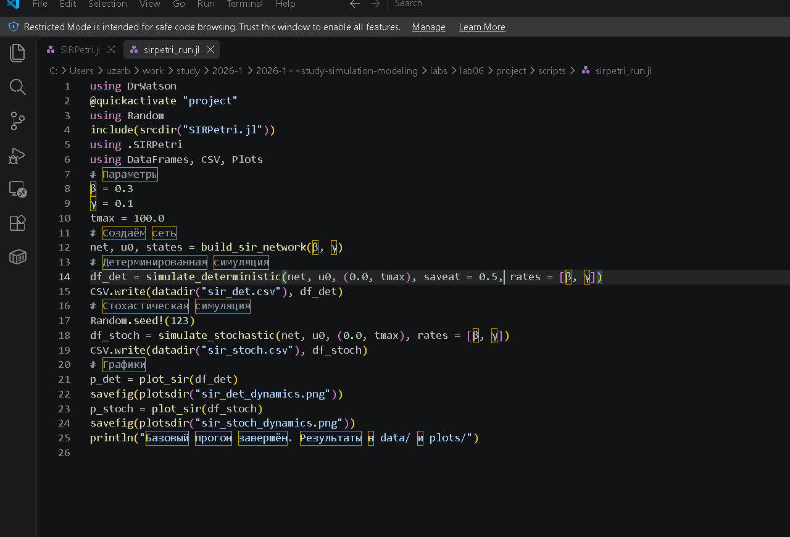{#fig-001 width=60%}

## Запуск скрипта базового прогона

Запустим скрипт.

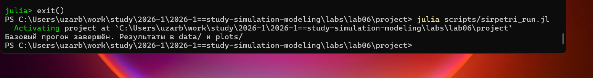{#fig-002 width=60%}

## Создание производных форматов

Создадим все производные форматы.

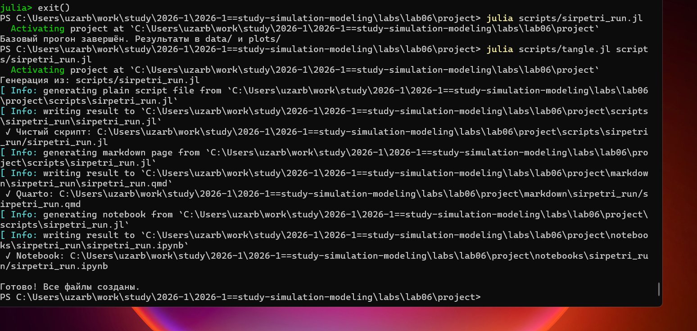{#fig-003 width=60%}

## Запуск Jupyter Notebook

Запустим notebook файл.

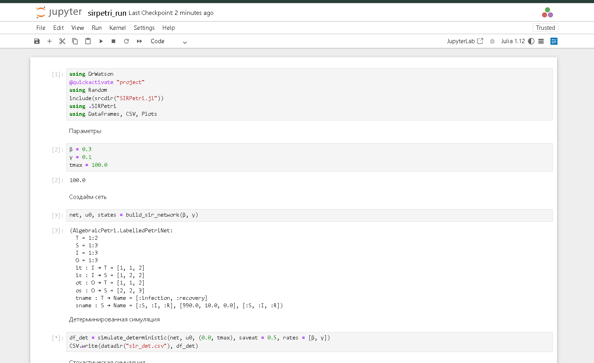{#fig-004 width=60%}

## Графики базового прогона

В результате получаем следующие графики ([рис. @fig-005], [рис. @fig-006]).

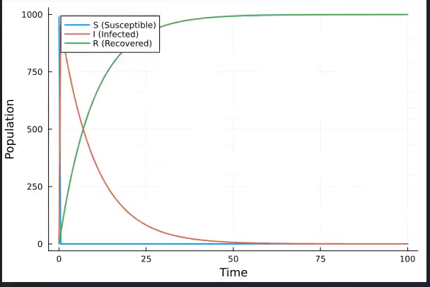{#fig-005 width=50%}

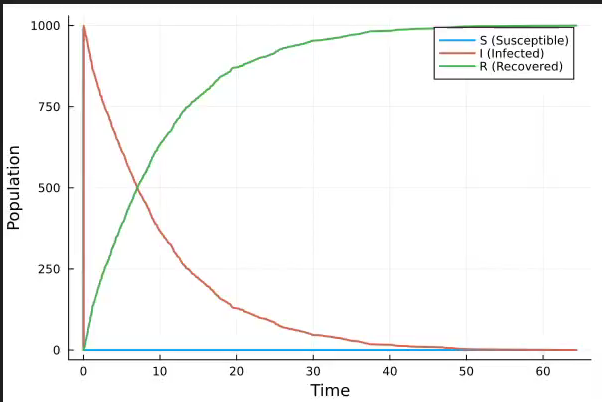{#fig-006 width=50%}

## Код базового прогона




## Исследование параметра β

Исследуем чувствительность модели к изменению параметра β (скорости заражения).

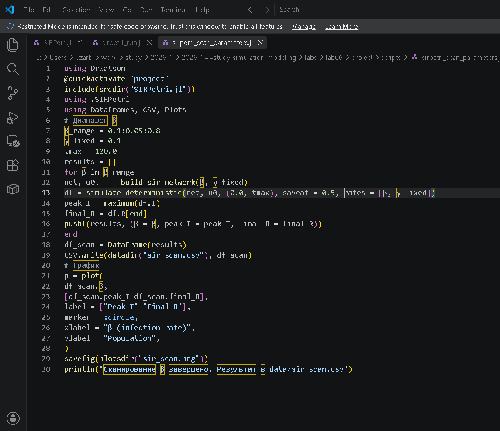{#fig-007 width=60%}

## Запуск скрипта исследования

Запустим скрипт.

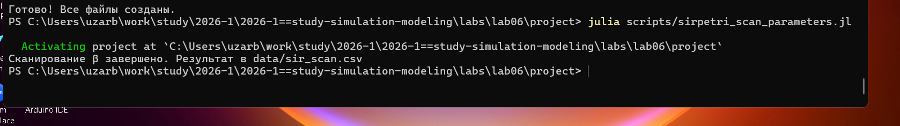{#fig-008 width=60%}

## Форматы и Notebook (β)

Создадим все производные форматы.

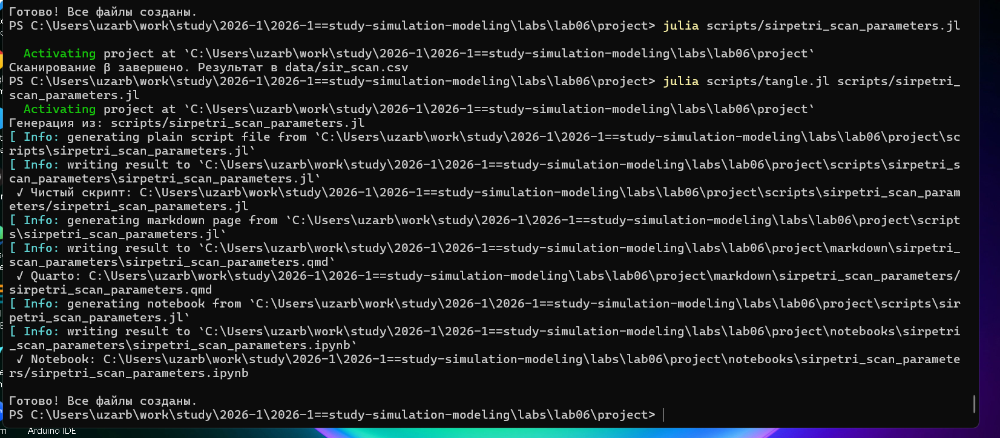{#fig-009 width=60%}

## Результат сканирования параметров

В результате получим следующий график.

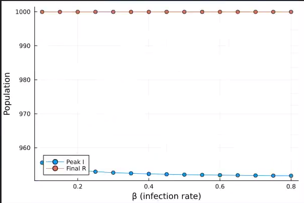{#fig-010 width=60%}

## Код: сканирование параметров




## Анимация динамики

Создадим GIF-анимацию, показывающую как со временем меняются количество людей в каждой из трех групп.

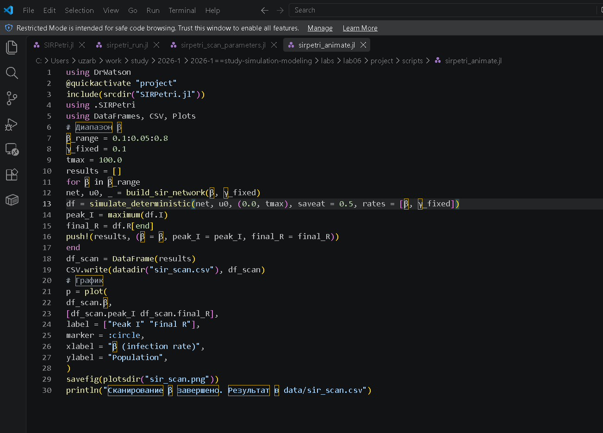{#fig-011 width=60%}

## Запуск скрипта анимации

Запустим скрипт.

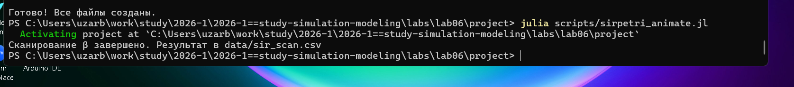{#fig-012 width=60%}

## Форматы анимации

Создадим все производные форматы.

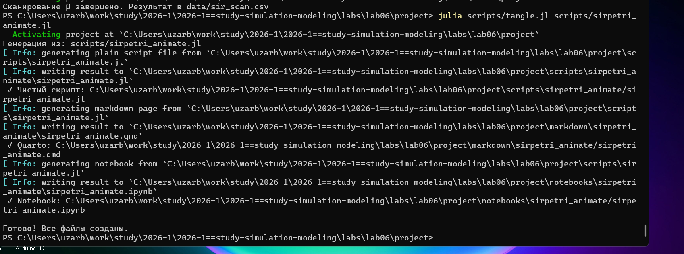{#fig-013 width=60%}

## Notebook анимации

Запустим файл notebook.

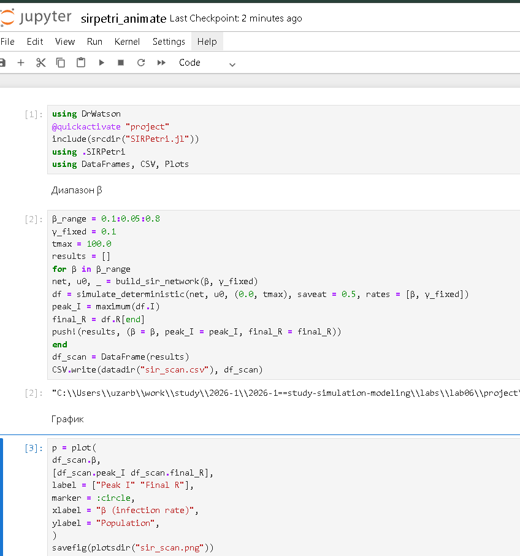{#fig-014 width=60%}

## Код: Анимация




## Подготовка итогового отчета

Загрузим ранее сохраненные результаты и построим сравнительные графики для итогового отчета.

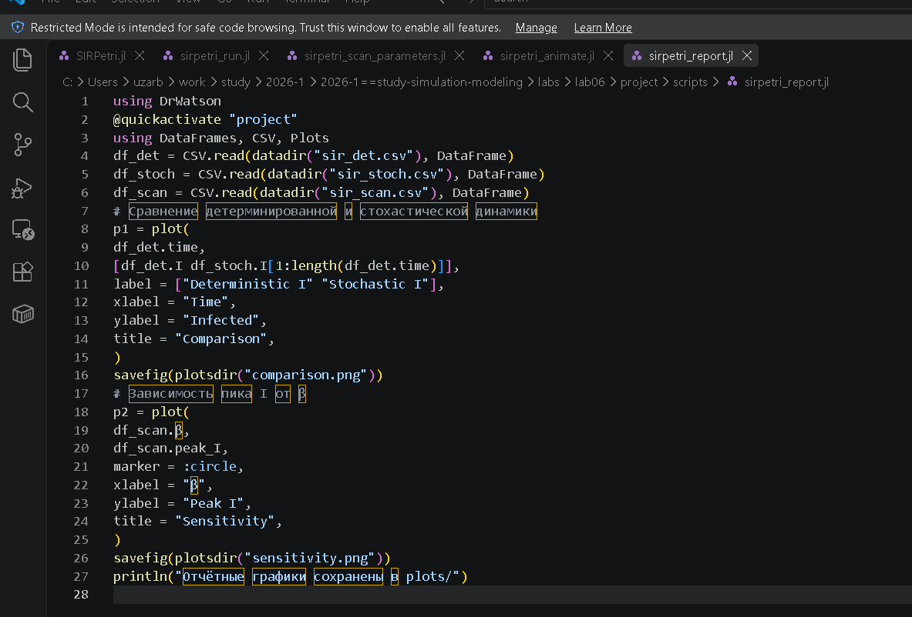{#fig-015 width=60%}

## Запуск скрипта отчета

Запускаем скрипт.

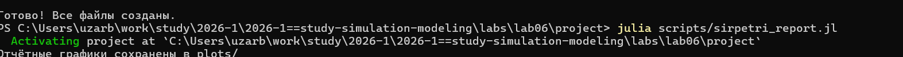{#fig-016 width=60%}

## Форматы и Notebook отчета

Создадим все производные форматы и запустим notebook.

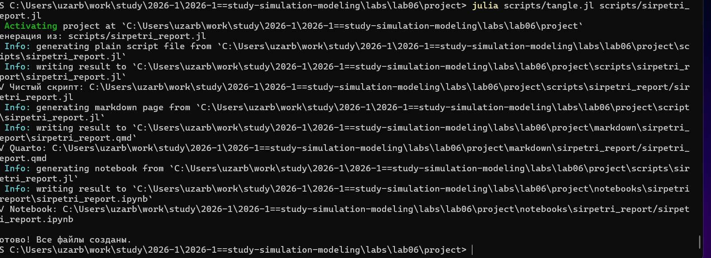{#fig-017 width=60%}

## Графики итогового отчета (1)

Получим следующие сравнительные графики.

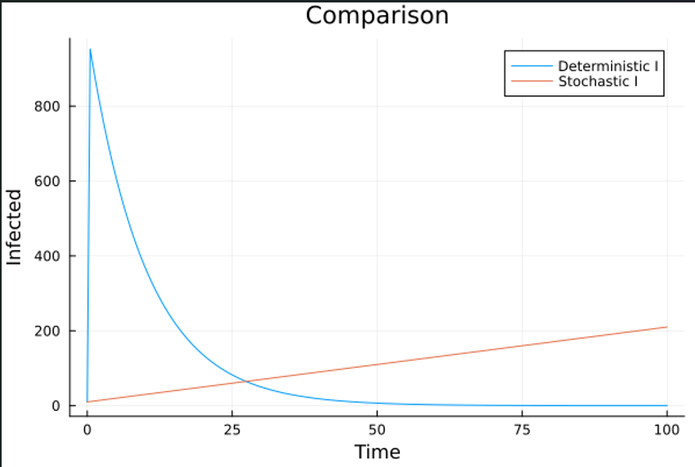{#fig-018 width=60%}

## Графики итогового отчета (2)

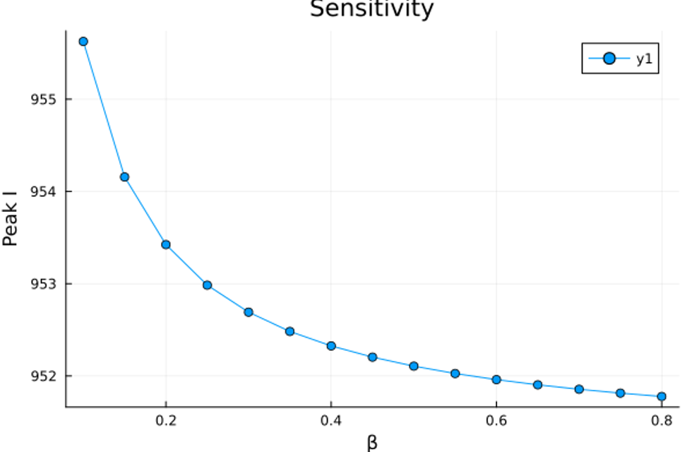{#fig-019 width=60%}

## Код: Итоговый отчет




# Выводы

После выполнения данной лабораторной работы мы реализовали модели SIR с помощью сетей Петри, успешно сгенерировали отчеты, ноутбуки и документацию в формате Quarto, а также исследовали зависимость модели от параметров.