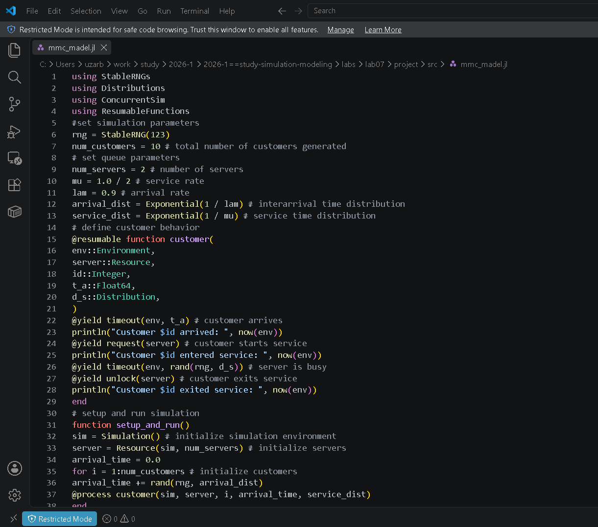
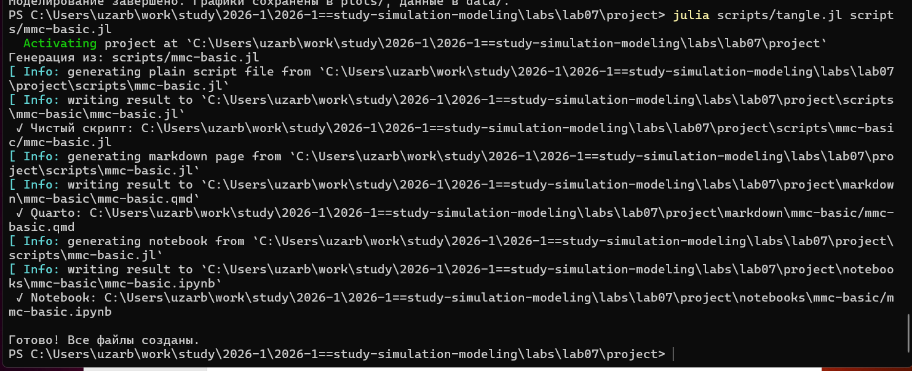
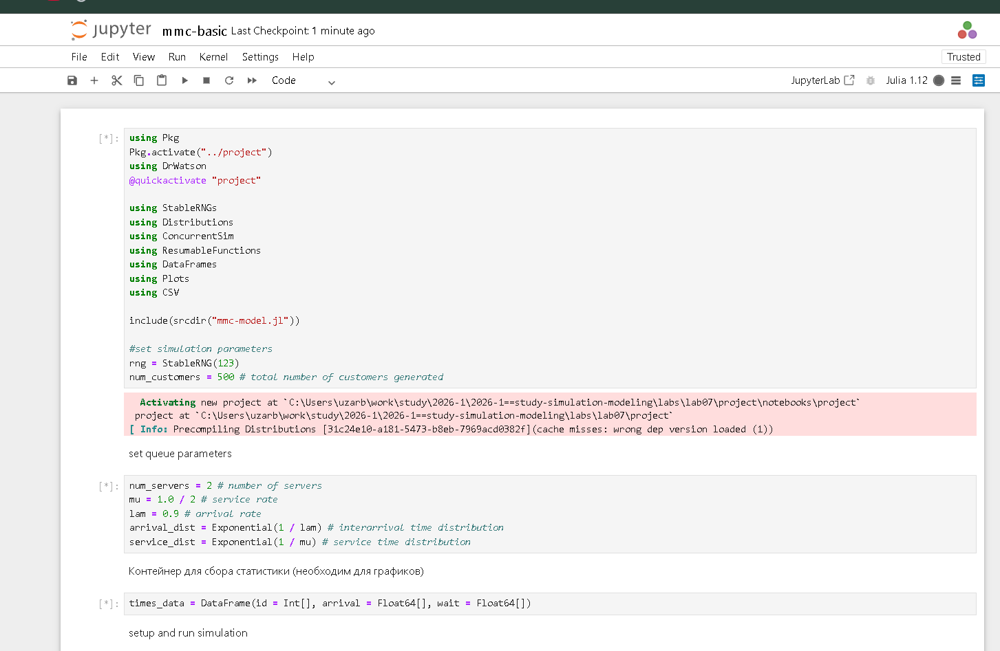
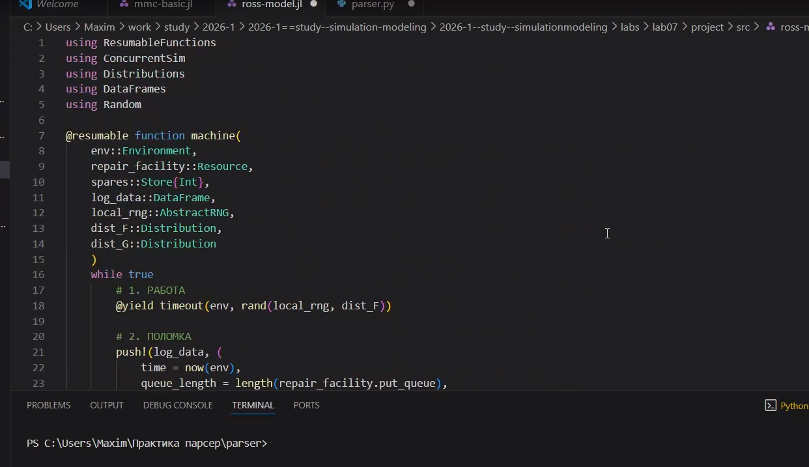
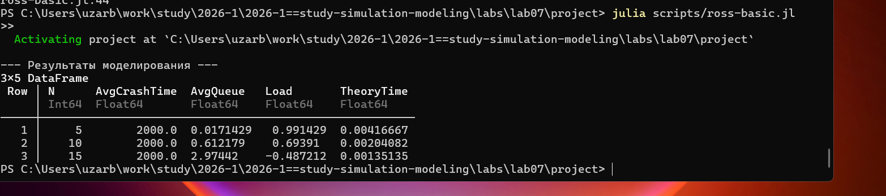
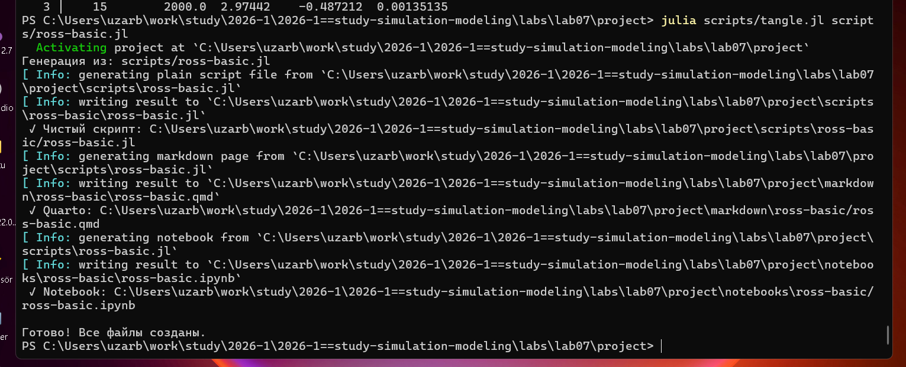
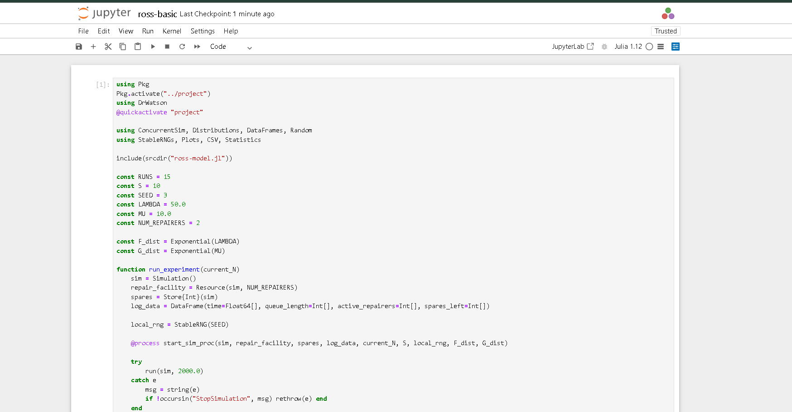
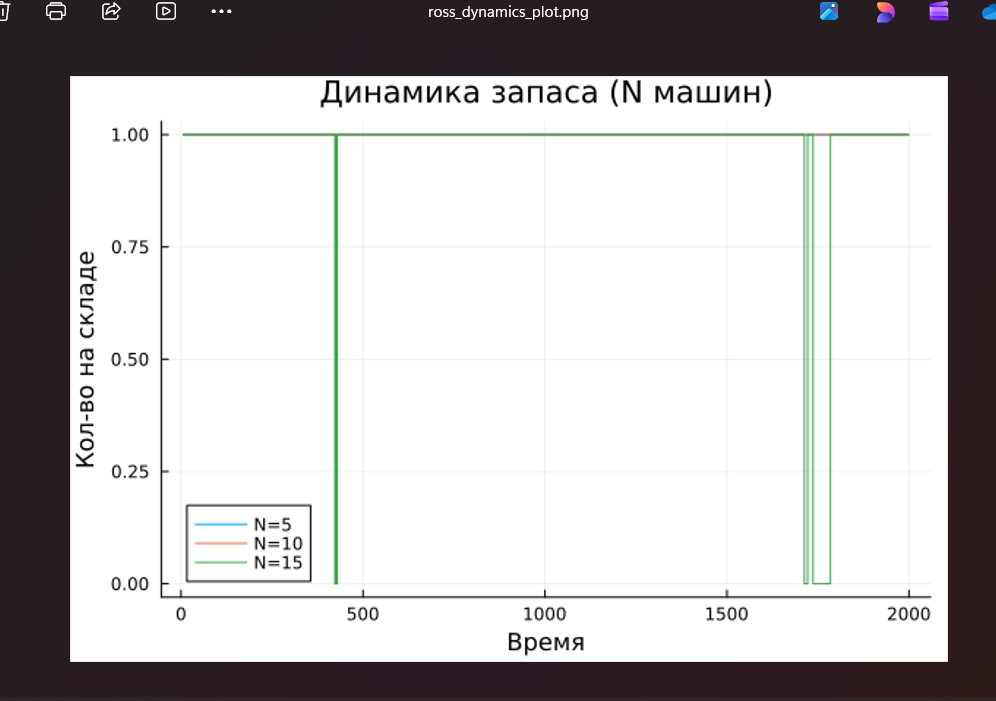

# Цель работы

Целью данной лабораторной работы является реализация имитационной
модели Росса (задачи о ремонте оборудования) с использованием дискретнособытийного моделирования и анализ показателей надежности системы при
различных нагрузках.

# Задание

- Создать рабочий каталог для кода.
- Установить необходимые пакеты.
- Выполнить предложенный код.
- Преобразовать код в литературный стиль.
- Сгенерировать из литературного кода:
  - чистый код;
  - jupyter notebook;
  - документацию в формате Quarto.
- Выполнить код из jupyter notebook.
- Интегрировать документацию в формате Quarto в отчёт.
- Добавить в код в литературном стиле вычисление для набора параметров.
- Сгенерировать из литературного кода с параметрами:
  - чистый код;
  - jupyter notebook;
  - документацию в формате Quarto.
- Выполнить код из jupyter notebook с параметрами.
- Интегрировать документацию с параметрами в формате Quarto в отчёт.

# Теоретическое введение

## Модель M/M/c

Модель M/M/c (по классификации Кендалла) — это система массового обслуживания со следующими свойствами:
- M (Markovian) — входящий поток заявок пуассоновский, интервалы между прибытиями распределены экспоненциально с параметром $\lambda$.
- M — время обслуживания каждой заявки распределено экспоненциально с параметром $\mu$.
- c — количество идентичных обслуживающих приборов (каналов), работающих параллельно.

## Модель Росса

Модель представляет собой классический пример системы массового обслуживания с конечной популяцией, резервом и ремонтом.

- В системе находятся $N$ идентичных машин, которые постоянно работают и могут выходить из строя.
- $S$ машин находятся в резерве и готовы немедленно заменить любую отказавшую.
- Одно ремонтное устройство (ремонтник), которое может одновременно ремонтировать только одну машину.
- Когда работающая машина ломается, происходит следующее:
  - Немедленно берётся одна резервная машина (если она есть) и запускается в работу вместо сломавшейся.
  - Сломанная машина отправляется в ремонт.
  - Если резерва нет, система падает (crash). Моделирование заканчивается.
  - После ремонта машина пополняет пул резервных (становится исправной и ждёт).
- Требуется оценить среднее время до падения системы $E[T]$ при заданных распределениях наработки до отказа и времени ремонта.

# Выполнение лабораторной работы

## Модель M/M/c: Логика модели
Создаю в папке /src файл с логикой модели (@fig-001).

{#fig-001 width=60%}

## Модель M/M/c: Базовый прогон
Далее создаю и запускаю код с базовым прогоном модели (@fig-002).

{#fig-002 width=60%}

## Модель M/M/c: Производные форматы
Создаю все производные форматы (@fig-003).

{#fig-003 width=60%}

## Модель M/M/c: Notebook
Запускаю файл notebook (@fig-004).

{#fig-004 width=60%}

---



## Модель Росса: Логика модели
Создаю в папке /src файл с логикой модели Росса (@fig-005).

{#fig-005 width=60%}

## Модель Росса: Прогон модели
Запускаю файл с прогоном модели (@fig-006).

{#fig-006 width=60%}

## Модель Росса: Производные форматы
Создаю все производные форматы (@fig-007).

{#fig-007 width=60%}

## Модель Росса: Notebook
Запускаю файл notebook (@fig-008).

{#fig-008 width=60%}

## Модель Росса: Результаты и график
В результате получаю следующий график (@fig-009).

{#fig-009 width=60%}

---



# Выводы

В результате выполнения данной лабораторной работы мы научились создавать модель Росса с помощью дискретнособытийного моделирования и анализ показателей надежности системы.

# Список литературы{.unnumbered}

::: {#refs}
:::