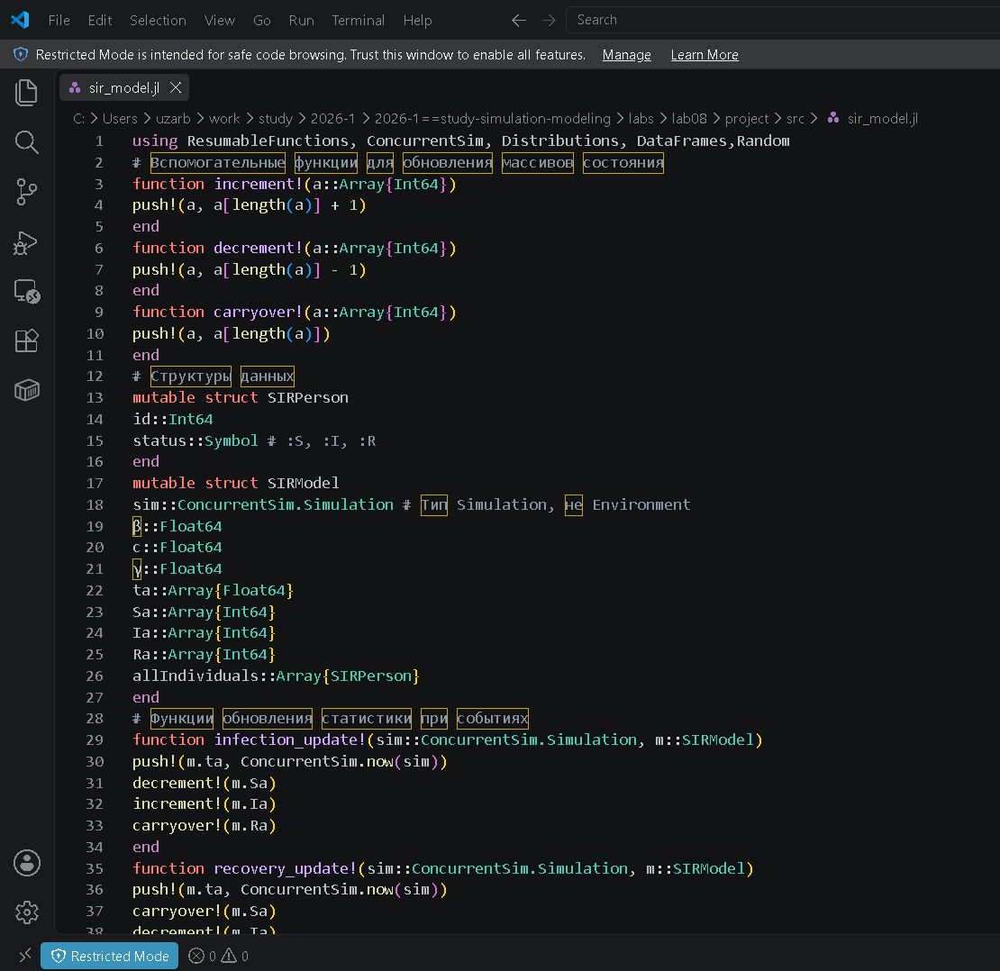
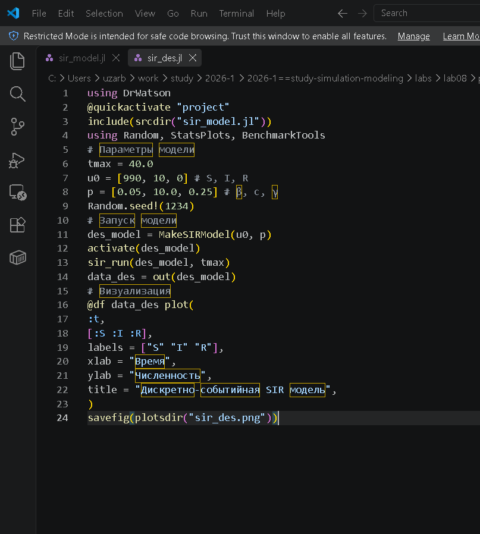
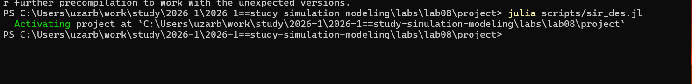
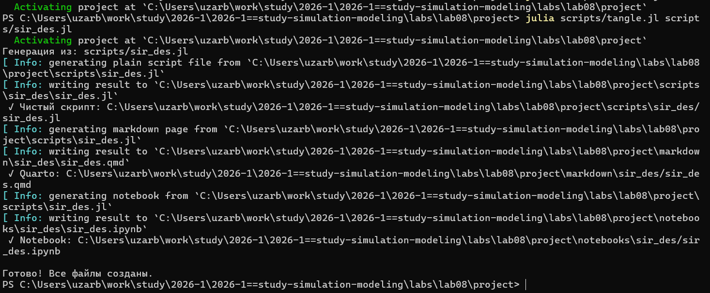
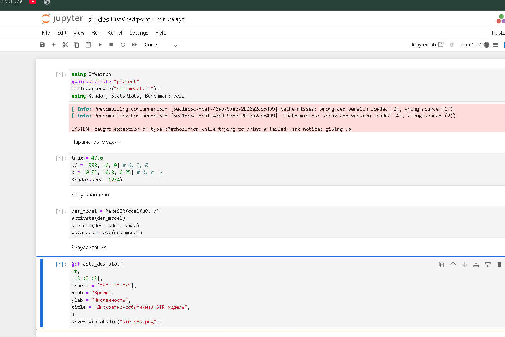
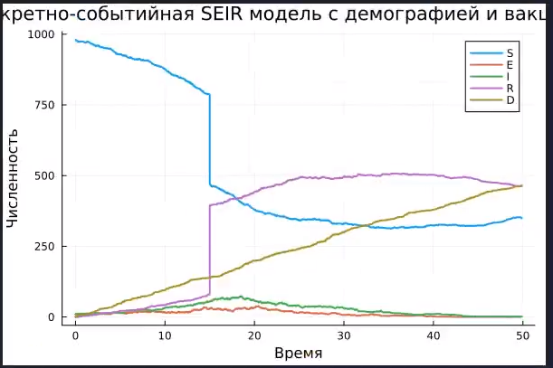
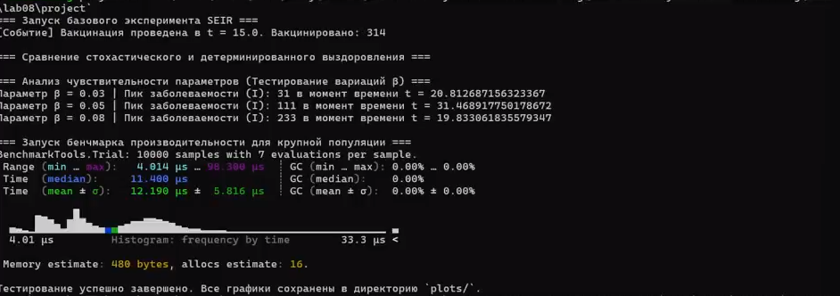
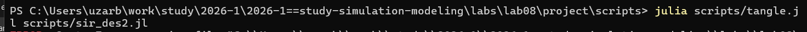
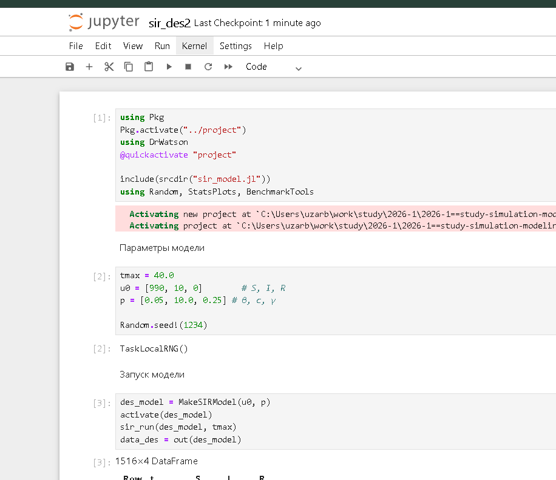
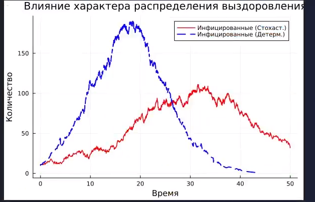

# Цель работы

Изучить дискретно-событийный подход к имитационному моделированию на
примере классической модели распространения инфекции SIR. Реализовать стохастическую дискретно-событийную модель в виде программного комплекса на
языке Julia. Провести анализ влияния параметров, сравнить со стохастической и
детерминированной версиями, оценить производительность и модифицировать [@RUDN_ESystem]
модель.

# Задание

- Создать рабочий каталог для кода.
- Установить необходимые пакеты.
- Выполнить предложенный код.
- Преобразовать код в литературный стиль.
- Сгенерировать из литературного кода:
  - чистый код;
  - jupyter notebook;
  - документацию в формате Quarto.
- Выполнить код из jupyter notebook.
- Интегрировать документацию в формате Quarto в отчёт.
- Добавить в код в литературном стиле вычисление для набора параметров.
- Сгенерировать из литературного кода с параметрами:
  - чистый код;
  - jupyter notebook;
  - документацию в формате Quarto.
- Выполнить код из jupyter notebook с параметрами.
- Интегрировать документацию с параметрами в формате Quarto в отчёт

# Теоретическое введение

## Общий алгоритм

Программа моделирует стохастическое распространение инфекции в полностью
смешивающейся популяции конечного размера. В отличие от детерминированной системы ОДУ, здесь наблюдаются случайные флуктуации, а также возможны
ранние вымирания от инфекции при малых начальных I.

- Инициализация: создание объектов индивидов с начальными статусами, инициализация статистических массивов.
- Планирование процессов: для каждого индивида создаётся параллельный
процесс (@process), реализующий его жизненный цикл.
- Запуск симуляции: ConcurrentSim.run продвигает виртуальное время, обрабатывая события в хронологическом порядке. Каждый timeout добавляет событие в календарь; когда время
- Сбор статистики: в момент изменения состояния индивида обновляются временные ряды Sa, Ia, Ra, а также запоминается текущее время.
- Завершение: по достижении tf симуляция останавливается. Все накопленные
ряды экспортируются в таблицу.
- Постобработка: построение графиков, сохранение результатов.

# Выполнение лабораторной работы

## Создание ядра программы
Создаю ядро программы, которое будет использоваться в основном коде (@fig-001).

{#fig-001 width=60%}

## Основной код модели
Создаю основной код с базовым прогоном модели (@fig-002).

{#fig-002 width=60%}

## Запуск базового прогона
Запускаю базовый прогон (@fig-003).

{#fig-003 width=60%}

## Генерация форматов (1)
Создаю все производные форматы (@fig-004).

{#fig-004 width=60%}

## Запуск Notebook
Запускаю файл notebook (@fig-005).

{#fig-005 width=60%}

## Результат моделирования
В результате получаю следующий график (@fig-006).

{#fig-006 width=60%}



## Модификация параметров
Далее модифицирую код, в котором задаю разные значения для модели и запускаю его (@fig-007).

{#fig-007 width=60%}

## Генерация форматов (2)
Создаю все производные форматы (@fig-008).

{#fig-008 width=60%}

## Запуск измененного Notebook
Запускаю файл notebook (@fig-009).

{#fig-009 width=60%}

## Итоговые графики
В результате получаю следующие графики (@fig-010).

{#fig-010 width=60%}



# Выводы

После выполнения данной лабораторной работы мы изучили дискретно-событийный подход к имитационному моделированию на примере классической модели распространения инфекции SIR.

# Список литературы{.unnumbered}

::: {#refs}
:::